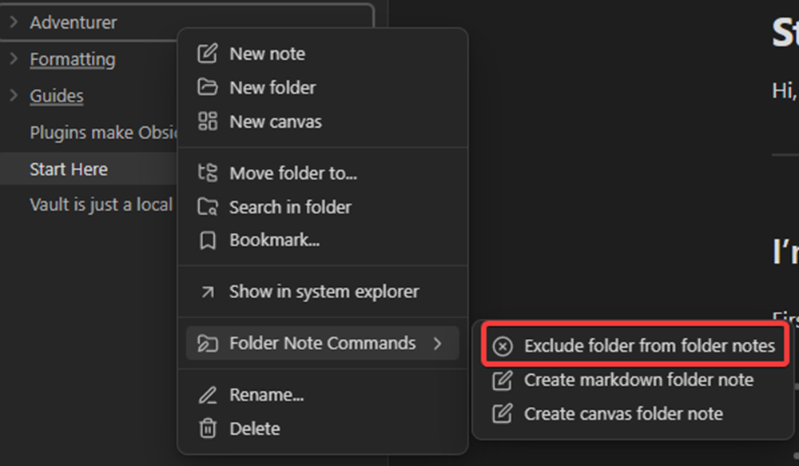
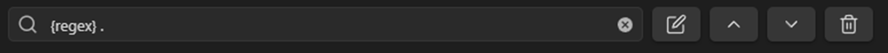
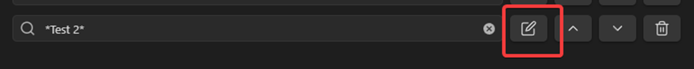

# Exclude folders
The exclude folder feature can be found in the plugin settings under the tab "Exclude folders".
## Exclude only one folder
To only exclude the folder itself and not the sub folders also you have to click on the edit icon and disable include subfolders in the settings.
### Directly in the settings
Click on the plus icon, then click on the text input, search a folder name and then select the folder you want to exclude from the list.

### Through the file explorer
Click on a folder and then use the context menu and click on "exclude folder from folder notes". The plugin will then apply the [default exclude folder settings](#Default settings) and add it to the excluded folders list.

## Exclude a folder and their subfolders
To exclude a folder and its subfolders you have to do the same steps as in how to exclude only one folder but enable include subfolders in the settings of an excluded folder.
## Exclude multiple folders (with a pattern)
The pattern only looks at the names of the folders and nothing else. You have to options to exclude folders with a pattern and the first option is to use * before and after the string. The second option is to use a [regex](https://en.wikipedia.org/wiki/Regular_expression).

To use a regex you have to add "{regex}" at the beginning of the string and everything after it is going to be a regex that matches the folder names.

For example this regex matches every folder in the file explorer.

When we use * to match a folder it only works when it's at the start or at the end of a string or both.
For example when we use the folder name "Test" and the following patterns we get this:

\*est => matches the name
Test* => matches the name
\*es\* => matches the name
\*Test\* => matches the name
\*Test 2\* => doesn't match the name
## How to change the settings
Open the exclude folders settings tab and click on a edit button if you've already excluded folders or added patterns to exclude folders.

## Default settings
To edit the default settings for new excluded folders/patterns you just have to click on one of the "Manage" buttons in the settings that are next to "Exclude folder/pattern default settings".