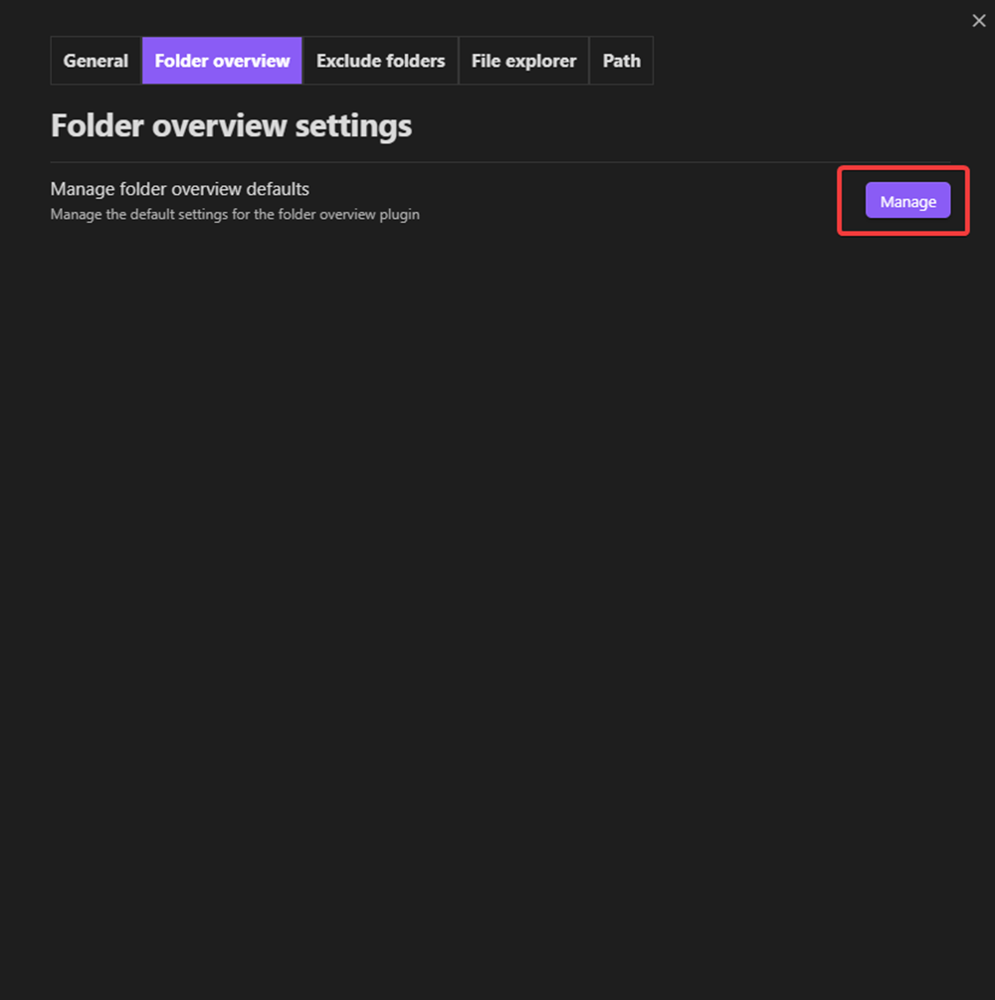

# Folder overview

## Create overview 
There are two options to create a folder overview in a note

- Use the command "Insert folder overview" from the [command palette](https://help.obsidian.md/Plugins/Command+palette)
- On desktop right click and click on the option "Create folder overview"
## Edit overview
If the overview shows no files or folders yet you can just click on the button that says "Edit overview". But if there are already files/folders it's a bit more complicated than the button and to then edit the overview you have to hover over the overview and click on the "Edit this block" button on the right top corner of the overview with only an icon.

The video below shows the steps explained in the text.
<source src="../assets/n5AGi3VCxF5JcNx2Wm5O.mp4" type="video/mp4">

## Default settings
To edit the settings for a new folder overview that hasn't been created yet you have to open the plugin settings and go to the folder overview tab and click on the manage button.
