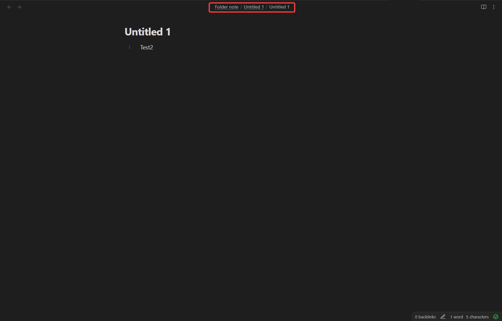

# Path settings
The "path" is the file path above a note in the editor.

### Open folder note through path
Open a folder note by click on a folder name in the path when it has a folder note linked to it.

### Open sidebar when opening a folder note through path
Disable/enable if the left sidebar should also open when you open a folder note through the path.

### Auto update folder name in the path ([front matter title plugin only](https://github.com/snezhig/obsidian-front-matter-title))
Automatically update the folder name in the path when the front matter title plugin is enabled and the title for a folder note is changed in the front matter. This will not change the file name, only the displayed name in the path.

## Style settings

### Underline folder in the path
Underline every folder with a folder note in the path.

### Bold folders in the path
Bold every folder with a folder note in the path.
### Cursive folders in the path
Make every folder with a folder note in the path cursive.