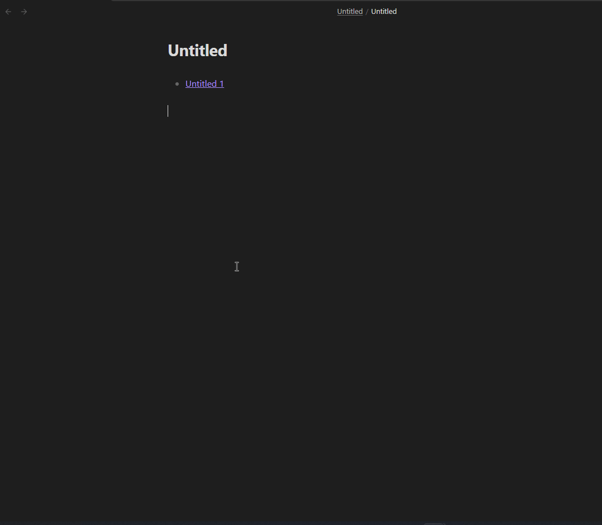

# Getting started

## How to install the plugin

The plugin can be downloaded by clicking on https://obsidian.md/plugins?id=folder-notes and then on install.

## Basic features 

### Create folder overview

Find more out about the folder overview feature on the [folder overview page](./Features/Folder%20overview.md)

To create a folder overview in a note either use the command "Insert folder overview" or right click on pc and select "create folder overview"

The folder overview with the default settings looks like this with one note

To edit the folder overview click on the little icon on the right that is shown when hovering over the codeblock

### Create & open folder note

There are three options: the context menu, ctrl/strg + click and commands

Right click or on mobile hold longer on a folder name to get to the context menu and then click on create folder note.

On PC either use ctrl or strg (depending on your settings) and then click on a folder name to create a folder note.

Open the [command palette](https://help.obsidian.md/Plugins/Command+palette) and then type "folder notes" and select the command you need.

