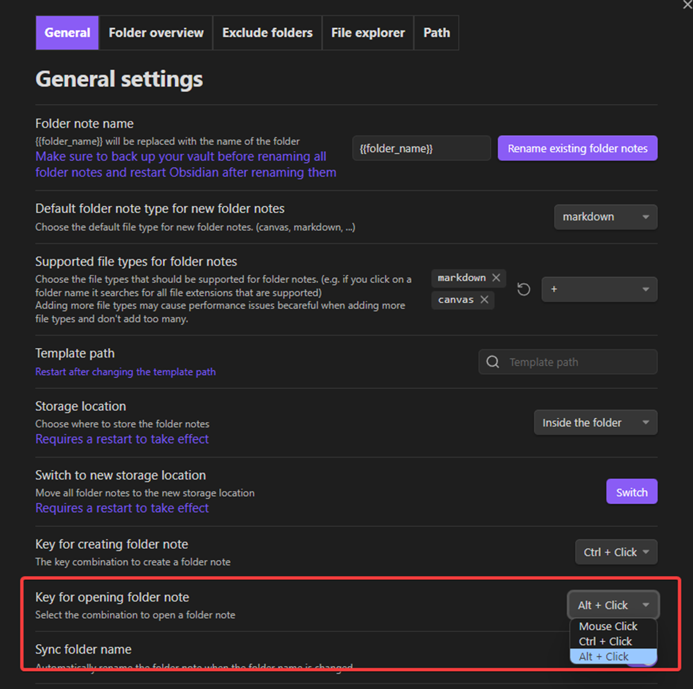

# Getting started

## How to install the plugin

The plugin can be downloaded by clicking on https://obsidian.md/plugins?id=folder-notes and then on install.

## Basic features 

### Create folder overview

Find more out about the folder overview feature on the [folder overview page](./Features/Folder%20overview.md)

To create a folder overview in a note either use the command "Insert folder overview" or right click on pc and select "create folder overview"

{: style="max-width: 40%;max-height: 40%"}

The folder overview with the default settings looks like this with one note

To edit the folder overview click on the little icon on the right that is shown when hovering over the codeblock

### Create folder note

There are three options: the context menu, ctrl/strg + click and commands

Right click or on mobile hold longer on a folder name to get to the context menu and then click on create folder note.

On PC either use ctrl or strg (depending on your settings) and then click on a folder name to create a folder note.

Open the [command palette](https://help.obsidian.md/Plugins/Command+palette) and then type "folder notes" and select the command you need.

### Open folder note

If you haven't changed any settings the simplest option is just to click on the name of a folder to open its folder note.

Use the context menu and instead of create click of open folder note. It only works with folders that also have a folder note and [if you don't know how to open the context menu click here.](#Create folder note)

The second option is to open one file of the files from the folder from which you want to open the folder note and then use the command "Open folder note of current folder of active note" from the [command palette](https://help.obsidian.md/Plugins/Command+palette)

The last option and the option that is only available to desktop users is to use alt or ctrl and click on the folder name. When you don't hold ctrl/alt and click on a folder name the folder gets collapsed as normal. To use this option you first have to enable it in the plugin settings under the tab general.

